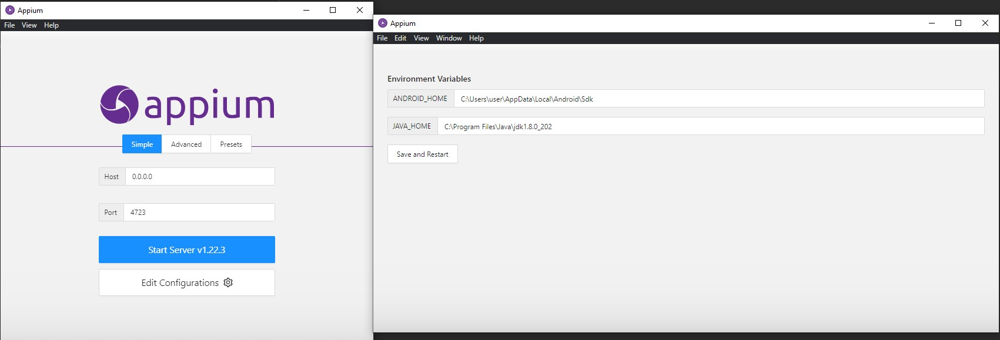

## Hello everyone!

This is my project for automated testing of a mobile application.
The mobile app itself has not been added because it is under development.

### 🐍 Stack:

### ⚡ Installation:
* <a link href="https://www.oracle.com/java/technologies/javase/javase8-archive-downloads.html">Download</a> 
and install Java 8 (cuz Android uiautomatorviewer supported only)

* Configurate Appium server:

* Start server.

* Run in terminal of your IDE:

`pip install -r .\requirments.txt`